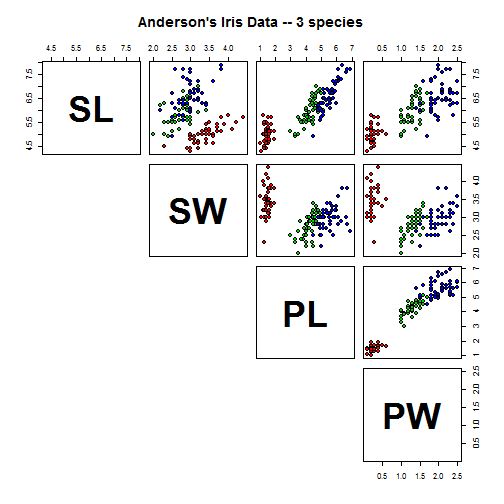

## What is the Iris Dataset Analysis ShinyApp?

 - The shinyapp created compares the length and width of petals with the length and width of sepals.

 - The data comes from the Fisher's iris data set.

 - It utilizes an interactive interface to compare the different variables from Fisher's iris data set.

---

## Examination of Fisher's Iris Data Set

 - Consists of 50 samples from each of 3 species of Iris (Iris setosa, Iris virginica & Iris versicolor).

 - Four features measured from each sample: length and width of sepals and petals (in cm).

 

---

## Why is the Iris Dataset Analysis ShinyApp important?

> 1. Makes it easy to understand & analyze Fisher's iris data set

> 2. Uses an interactive interface to visualize that data for each variable

> 3. Quick and easy to use by all types of end users

---

## How the Iris Dataset Analysis ShinyApp works?

 - To begin using the Iris Dataset Analysis ShinyApp you must first launch the ShinyApp.
 
 - Then to compare variables against each other choose a variable from the drop down menu of the 'First Variable' and a variable from the drop down menu of the 'Second Variable' to compare the variables against each other.
 
 - Then a graph will populate the data of the variables that were compared against each other.
 
 - Each species is color coded in the graph displayed to distinguish between each of the three species.
 
